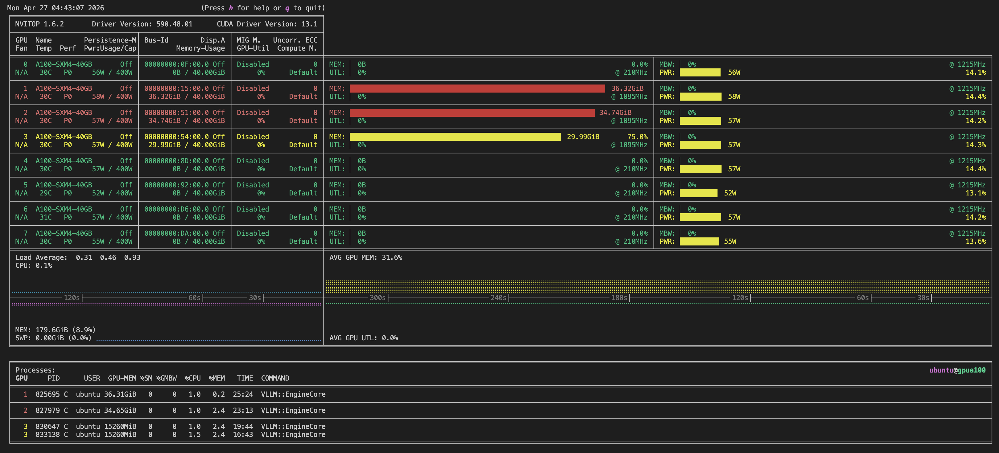

# Changelog

## `--moe-cpu-offload`

Added Case 1 MoE CPU offload support.

Implementation module:

```text
vllm/model_executor/layers/fused_moe/moe_offload.py
```



### Feature

- Adds one public flag: `--moe-cpu-offload`.
- Dense models ignore the flag and run normally.
- MoE models enable CPU-backed expert staging.
- Large MoE LLMs can reside on smaller GPUs by keeping expert weights in CPU
  memory and using GPU memory only for routing, KV cache, and active expert
  compute.
- Multiple large MoE LLM instances can reside on the same GPU more easily
  because inactive expert weights do not need to occupy GPU memory.
- Full expert weights stay in CPU memory as the source of truth.
- Router path and KV cache stay on GPU.
- Active experts are transferred passively after router computation identifies
  the routed expert set.
- Compute uses passive expert model loading: route first, copy only the needed
  active expert weights to GPU, compute, then release those GPU expert copies.
- GPU expert copies are retired/freed after active expert computation.
- If active experts cannot fit as one group, execution can be split into smaller
  passive waves.
- Before GPU expert transfer, free GPU memory is checked. If memory is
  insufficient, transfer waits 5 seconds and retries up to 10 times.

## `--moe-gpu-prefetch <num>`

Added Case 2 MoE GPU active expert prefetch support.

Implementation module:

```text
vllm/model_executor/layers/fused_moe/moe_gpu_prefetch.py
```

### Feature

- Adds one public flag: `--moe-gpu-prefetch <num>`.
- Dense models ignore MoE offload flags and run normally.
- MoE models with this flag use Case 2 even when `--moe-cpu-offload` is also
  present.
- Full expert weights remain CPU-backed.
- Router path, KV cache, and essential runtime structures stay on GPU.
- Runtime keeps active, working, and missing expert lists inside the Case 2
  module.
- GPU-side routed metadata builds compact expert token counts for pager
  decisions.
- Resident expert waves can execute first while missing experts are recorded for
  the pager.
- The pager thread loads missing experts into GPU active slots and can evict cold
  resident experts when capacity is needed.
- H2D copies use a small copy-stream pool controlled by
  `VLLM_MOE_PREFETCH_COPY_STREAMS`.

### Module Boundary

- Case 1 passive behavior stays in `moe_offload.py`.
- Case 2 pager behavior stays in `moe_gpu_prefetch.py`.
- Shared layer/config code only selects and wires the correct implementation.

### Example Test Layout

- Endpoint 1: one `gemma-4-26B-A4B-it` MoE model on one A100 40GB GPU.
- Endpoint 2 and 3: two `gemma-4-26B-A4B-it` MoE model instances sharing one
  A100 40GB GPU, each served from a separate vLLM endpoint.
- This validates the intended use case: passive expert loading lets large MoE
  models fit on smaller GPU memory budgets and allows multiple large MoE
  endpoints to colocate on the same GPU.

### Known Non-Fatal Warnings

- Performance can degrade versus all-GPU expert residency because active expert
  weights are copied from CPU memory to GPU memory during inference.
- vLLM may warn that model `generation_config.json` overrides default sampling
  parameters.
- vLLM may warn about missing optimized fused MoE config files and fall back to
  default MoE configs.
